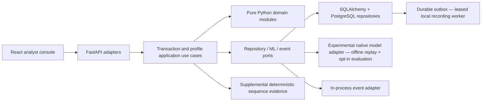

# FraudLens

**Explainable Adaptive Behavioral Fraud Detection System**

FraudLens is a research-oriented modular monolith investigating how banking fraud
detection can learn legitimate behavior changes without letting exceptional or
fraudulent transactions corrupt a customer's normal baseline.

**Status: Phase 15 security foundation plus supplemental sequence-evidence checkpoint; not a deployable fraud product.**
Submission/retrieval, scoped service credentials, durable request replay and atomic
audit/outbox storage are implemented on PostgreSQL. Opt-in experimental HTTP evaluation
now atomically retains its exact captured facts, vector, policy, result, optional native-model
explanation and response. Scoped analyst cases and immutable feedback history are durable.
There is no production risk endpoint or human login. The local analyst console uses
operator-pasted, expiring service credentials and must not be exposed remotely.
Profile reads now expose robust short/long statistics, cold-start states and immutable
revision selection. Profile admission requires the separately authorized experimental workflow.
The pure feature engine provides 29 ordered features with explicit missing-history indicators,
scoped PostgreSQL capture and offline artifact replay. See [development.md](development.md)
for capture/replay commands and [ADR-010](docs/adr/ADR-010-feature-context-and-availability.md)
for temporal and provenance limits.
Five versioned rules now produce stable reasons and explicit unavailable-input outcomes
from captured features; local rule replay is documented in the development runbook.
Experimental offline model replay now verifies native artifacts and exact feature contracts.
It remains synthetic-only and does not load a model into HTTP routes. See
[ADR-014](docs/adr/ADR-014-experimental-native-inference.md).
Rules-only, ML-only and hybrid offline risk replay now retain complete policy/evidence.
Missing required rule evidence produces no hybrid/rules-only score or action; all suggested
actions remain experimental and unexecuted. See [ADR-015](docs/adr/ADR-015-experimental-risk-and-decision.md).
Native TreeSHAP now explains the model margin with checked additivity and readable,
missing-aware contributions. Rule reasons stay separate; no causal claim is made. Add
`--explain` to offline risk replay; see [ADR-016](docs/adr/ADR-016-native-model-explanations.md).
Phase 11 exposes the same experimental composition behind disabled-by-default authenticated
routes and binds cases to stored evaluations. Feedback never executes an action, changes a
profile or trains a model. See
[ADR-017](docs/adr/ADR-017-durable-experimental-evaluations-and-review.md).
Phase 12 adds separately authorized learning decisions: reviewed cold-start bootstrap and
ordinary legitimate updates can create verified profile revisions, while exceptional,
stale or insufficient evidence remains quarantined and fraud is excluded. Low-weight
updates and corrections remain unavailable. See
[ADR-018](docs/adr/ADR-018-safe-profile-learning-authorization.md).
Phase 13 adds leased outbox delivery to a local deduplicating recording consumer, with
bounded retries, crash recovery and visible dead letters. It performs no external actions
and promises no exactly-once external delivery. See [ADR-019](docs/adr/ADR-019-outbox-delivery.md).
Phase 14 adds a scoped React/TypeScript console over factual PostgreSQL summary/worklist
projections, retained evaluation explanations, case review and profile reads. See
[ADR-020](docs/adr/ADR-020-analyst-console-and-scoped-read-model.md).
The supplemental sequence engine now retains four deterministic 24-hour patterns, including
low-and-slow transfers that can evade a single-amount anomaly. It requires verified admitted
history, produces explicit unavailable outcomes and does not change the uncalibrated risk-v1
score. See [ADR-022](docs/adr/ADR-022-supplemental-sequence-evidence.md) and the
[detector layers](docs/architecture/detector-layers.md).
See [PROJECT_STATUS.md](PROJECT_STATUS.md) for verified progress.

## Problem and behavioral fraud detection

A customer normally spending ₸30,000 may legitimately buy an ₸8,000,000 vehicle.
Treating every observed transaction as normal can contaminate an adaptive baseline
and make the next ₸500,000 fraudulent transfer look less unusual. Global amount
thresholds also miss differences between customers.

## Key idea: safe adaptive profiling

Keep risk evaluation separate from analyst truth and from permission to learn.
The initial pure domain implementation uses per-customer, per-currency rolling
median, MAD, nearest-rank p95, and short/long windows. A profile-update gate rejects
confirmed fraud, quarantines unverified activity, and keeps extreme legitimate
events outside the normal baseline. Ordinary confirmed transactions can enter it.

The current 10× median gate, five-observation minimum and sequence thresholds are
**uncalibrated research assumptions**. Low-weight updates and retractions remain future work.
Compromised analyst confirmations are not solved by this initial gate.

## Architecture



Domain code under `backend/app` imports no web framework, ORM or ML library.
Financial amounts use `Decimal`; timestamps must be timezone-aware and normalize
to UTC. Customer-local hours use IANA timezones. See
[architecture](docs/architecture/README.md) and [ADRs](docs/adr/).

## Screenshots

The functioning console is available locally after authenticated setup. Recruiter-facing
screenshots will be captured with deterministic synthetic demo data in Phase 16; no mock
screen is presented as measured production behavior.

## Demo scenarios

Domain regression tests cover normal confirmed activity, a quarantined ₸8M
purchase, preserved baseline for a subsequent ₸500k transfer, gradual confirmed
spending changes, and an unverified escalating sequence. Full seeded banking
scenarios and a live analyst demonstration are scheduled for Phase 16.

## Tech stack

Current: Python 3.13, uv, FastAPI/Pydantic, SQLAlchemy 2, Alembic, PostgreSQL,
React 19, TypeScript, Vite, Vitest, ESLint, Compose, pytest, Ruff, mypy and audits.

Offline ML group: NumPy, scikit-learn and XGBoost.
Native XGBoost TreeSHAP-equivalent contribution support is implemented without a new SHAP dependency.

## ML methodology and metrics

Three-seed **synthetic-only** comparisons now train Logistic Regression, Random Forest
and XGBoost with chronological train/validation/test splits and held-out customers.
[Measured results](ml/experiments/phase7-synthetic-v1/README.md) are engineering evidence,
not real-world fraud performance. A separate [ULB retrospective benchmark](ml/experiments/ulb-retrospective-v1/README.md)
now compares anonymized external features under its own contract. Neither result selects
a production behavioral model. Fit transforms and class-balancing methods on training data only.
Evaluate precision, recall, F1, ROC-AUC, PR-AUC and false-positive rate. Choose
thresholds and models on validation data; report the untouched test set once.
Feature generation must replay only history available before each transaction.
See [research protocol](docs/research/protocol.md).

## API

- `GET /health/live`: process liveness, version and implementation stage.
- `GET /docs`: development OpenAPI explorer.
- `POST /api/v1/customers`: admin-only synthetic customer enrollment; no profile admission.
- `POST /api/v1/transactions`: scoped service/admin intake with required Idempotency-Key.
- `GET /api/v1/transactions/{transaction_id}`: scoped service/analyst or admin retrieval.
- `GET /api/v1/customers/{customer_id}/profiles/{currency}`: scoped behavior summary;
  explicit historical cutoffs require a pinned profile version.

All business routes require an expiring bearer service credential. Intake returns
201 and RECEIVED status; matching retries return the exact stored response, changed
bodies or duplicate transaction IDs return 409. Amounts are decimal strings and
timestamps require a timezone. No risk prediction is fabricated. See the
[API setup and examples](development.md#authenticated-synthetic-api).
Liveness does not establish database/model readiness.

## How to run

Install [uv](https://docs.astral.sh/uv/getting-started/installation/), then:

```sh
uv sync --locked
uv run uvicorn backend.main:app --reload --host 127.0.0.1
```

Open http://127.0.0.1:8000/docs or http://127.0.0.1:8000/health/live.
Liveness runs without a database; business endpoints fail closed without credentials
and configured PostgreSQL. PostgreSQL and container foundation:

```sh
cp .env.example .env
# Edit .env: choose a local alphanumeric POSTGRES_PASSWORD and match DATABASE_URL.
docker compose up --build -d
docker compose exec backend alembic upgrade head
```

Migrations create 21 business and two outbox-operational tables plus database history protections, including
immutable profile revisions, evaluation/review records and profile-learning provenance.
The initial foundation marker is preserved in migration history. Compose includes PostgreSQL,
backend and the same-origin nginx frontend. Use a dedicated local
database; never point migration/test commands at a real banking database.

## Testing

```sh
uv run ruff check .
uv run ruff format --check .
uv run --group ml mypy
uv run --group ml pytest --cov=backend --cov-report=term-missing
uv export --locked --format requirements-txt --no-emit-project --no-hashes > /tmp/fraudlens-requirements.txt
uv run pip-audit --disable-pip --no-deps -r /tmp/fraudlens-requirements.txt
uv build
cd frontend && npm ci && npm run lint && npm test && npm run build
```

PostgreSQL tests skip explicitly unless `TEST_DATABASE_URL` points to a disposable
PostgreSQL database named `*_test`. Tests use a randomly named schema and remove
only that schema after execution. See [local PostgreSQL setup](development.md). CI supplies it and runs Alembic, tests,
dependency audit, package build and container build. A CI configuration is not a
claim that a remote workflow has run. Future ML/E2E test folders are documented
placeholders, not fake passing tests.

## Security

Synthetic UUIDs only; no real cardholder or identity data. No credentials in code;
database configuration uses environment variables and redacts secrets in settings.
Docker runs the backend without root and binds host ports to localhost. Production
mode hides API documentation. PostgreSQL triggers reject edits/deletes to historical
records, and repository writes participate in one explicit database transaction.
Business routes now use expiring hashed random service credentials, role/customer
scope checks, bounded request bodies and sanitized errors. Human authentication,
restricted runtime database grants, distributed rate limits and secure deployment
review remain future work. Keep this synthetic demo on localhost; remote use needs TLS.
A privileged database administrator can disable triggers; these guards are not
cryptographic tamper evidence.

## Limitations and research direction

This checkpoint verifies authenticated intake, experimental evaluation/review and domain
invariants; it does not establish fraud-detection accuracy or deployment security. Robust
profile summaries, bounded device/recipient activity features, deterministic rules and a
synthetic-only reviewed native model exist. Supplemental sequence evidence identifies several
24-hour low-and-slow patterns but is not part of risk-v1 scoring. Recipient account age and authoritative external
history are unavailable. Thresholds and scores are uncalibrated. Outbox storage, leased local
delivery and receipt deduplication exist; no external destination or continuous daemon exists.
Feedback is durable but does not authorize profile learning. See the research protocol for
baseline comparisons and threats to validity.

## Roadmap

1. Foundation and pure domain — implemented.
2. PostgreSQL tables, repositories, atomic unit of work and migration tests — implemented.
3. Authenticated transaction API with durable, scoped idempotency — implemented.
4. Versioned profile reads and behavior summaries — implemented; trusted admission remains deferred.
5. Versioned behavioral features and deterministic rules — implemented.
6. Offline model comparison, experimental inference, hybrid risk and SHAP — implemented;
   production behavioral validation remains open.
7. Durable experimental evaluation, cases, feedback and conservative profile learning —
   implemented; weights and corrections remain deferred. Leased local outbox delivery is implemented.
8. Local analyst console — implemented; human authentication/security review remains Phase 15.
9. Deterministic demos and research experiments.

## Continuation

Read [PROJECT_STATUS.md](PROJECT_STATUS.md), then
[NEXT_SESSION_PROMPT.md](NEXT_SESSION_PROMPT.md). Session facts are appended to
[SESSION_LOG.md](SESSION_LOG.md). The original specification is preserved in
[docs/PROJECT_SPECIFICATION.md](docs/PROJECT_SPECIFICATION.md).
