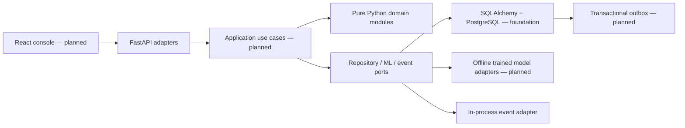

# FraudLens

**Explainable Adaptive Behavioral Fraud Detection System**

FraudLens is a research-oriented modular monolith investigating how banking fraud
detection can learn legitimate behavior changes without letting exceptional or
fraudulent transactions corrupt a customer's normal baseline.

**Status: tested foundation and domain checkpoint, not a deployable fraud product.**
The current HTTP application exposes liveness only. There is no transaction API,
trained model, authentication, analyst console, or persisted business data yet.
See [PROJECT_STATUS.md](PROJECT_STATUS.md) for verified progress.

## Problem and behavioral fraud detection

A customer normally spending ₸30,000 may legitimately buy an ₸8,000,000 vehicle.
Treating every observed transaction as normal can contaminate an adaptive baseline
and make the next ₸500,000 fraudulent transfer look less unusual. Global amount
thresholds also miss differences between customers.

## Key idea: safe adaptive profiling

Keep risk evaluation separate from analyst truth and from permission to learn.
The initial pure domain implementation uses per-customer, per-currency rolling
median, MAD, nearest-rank p95, and short/long windows. A profile-update gate rejects
confirmed fraud, quarantines unverified activity, and keeps extreme legitimate
events outside the normal baseline. Ordinary confirmed transactions can enter it.

The current 10× median gate and five-observation minimum are **uncalibrated
research assumptions**. Low-weight updates, bootstrap enrollment, suspicious
sequence detection, provenance enforcement and retractions remain future work.
Compromised analyst confirmations are not solved by this initial gate.

## Architecture



Domain code under `backend/app` imports no web framework, ORM or ML library.
Financial amounts use `Decimal`; timestamps must be timezone-aware and normalize
to UTC. Customer-local hours use IANA timezones. See
[architecture](docs/architecture/README.md) and [ADRs](docs/adr/).

## Screenshots

No frontend exists yet. Actual analyst-console screenshots will be added in Phase
18; no mock screenshot is presented as functioning software.

## Demo scenarios

Domain regression tests cover normal confirmed activity, a quarantined ₸8M
purchase, preserved baseline for a subsequent ₸500k transfer, gradual confirmed
spending changes, and an unverified escalating sequence. Full seeded banking
scenarios and a live analyst demonstration are scheduled for Phase 16.

## Tech stack

Current: Python 3.13, uv, FastAPI/Pydantic, SQLAlchemy 2, Alembic, PostgreSQL
Compose configuration, pytest, Ruff, mypy and pip-audit.

Planned: React/TypeScript/Vite; pandas, NumPy, scikit-learn, XGBoost and SHAP.
ML dependencies are deliberately deferred until the offline experiment phase.

## ML methodology and metrics

No model has been trained and **no predictive metrics are claimed**. Compare
Logistic Regression, Random Forest and XGBoost with chronological train/validation/
test splits. Fit transforms and class-balancing methods on training data only.
Evaluate precision, recall, F1, ROC-AUC, PR-AUC and false-positive rate. Choose
thresholds and models on validation data; report the untouched test set once.
Feature generation must replay only history available before each transaction.
See [research protocol](docs/research/protocol.md).

## API

- `GET /health/live`: process liveness, version and implementation stage.
- `GET /docs`: development OpenAPI explorer.
- Transaction submission, idempotency, authentication and feedback routes are not
  implemented. Liveness does not establish database/model readiness.

## How to run

Install [uv](https://docs.astral.sh/uv/getting-started/installation/), then:

```sh
uv sync --locked
uv run uvicorn backend.main:app --reload --host 127.0.0.1
```

Open http://127.0.0.1:8000/docs or http://127.0.0.1:8000/health/live.
This foundation app runs without a database. PostgreSQL and container foundation:

```sh
cp .env.example .env
# Edit .env: choose a local alphanumeric POSTGRES_PASSWORD and match DATABASE_URL.
docker compose up --build -d
docker compose exec backend alembic upgrade head
```

The initial migration is an explicit empty foundation marker; business tables
are Phase 2 work. Compose currently contains backend and PostgreSQL only; a
frontend service will be added when the console exists. Use a dedicated local
database; never point migration/test commands at a real banking database.

## Testing

```sh
uv run ruff check .
uv run ruff format --check .
uv run mypy
uv run pytest --cov=backend --cov-report=term-missing
uv export --locked --format requirements-txt --no-emit-project --no-hashes > /tmp/fraudlens-requirements.txt
uv run pip-audit --disable-pip --no-deps -r /tmp/fraudlens-requirements.txt
uv build
```

The PostgreSQL smoke test skips explicitly unless `TEST_DATABASE_URL` points to
a disposable PostgreSQL database. CI supplies it and runs Alembic, tests,
dependency audit, package build and container build. A CI configuration is not a
claim that a remote workflow has run. Future ML/E2E test folders are documented
placeholders, not fake passing tests.

## Security

Synthetic UUIDs only; no real cardholder or identity data. No credentials in code;
database configuration uses environment variables and redacts secrets in settings.
Docker runs the backend without root and binds host ports to localhost. Production
mode hides API documentation. Argon2 authentication, RBAC, immutable database
audit enforcement, request limits and secure deployment review remain mandatory
before business endpoints are exposed. Python frozen records are not a substitute
for append-only database permissions.

## Limitations and research direction

This checkpoint proves domain invariants, not fraud-detection accuracy or end-to-end
security. Profile windows are held in memory. Current typical hours are observed
hours, not a frequency-qualified estimate. No categories, device history, recipient
ages, feature extraction, model artifact or persistent outbox exists. Case history
is strict and immutable in memory; feedback persistence and concurrent updates
remain unimplemented. See the research protocol for baseline comparisons and
threats to validity.

## Roadmap

1. Foundation and pure domain (current checkpoint).
2. PostgreSQL tables, repositories, atomic unit of work and migration tests.
3. Authenticated transaction API with durable, scoped idempotency.
4. Profile history, production features and deterministic rules.
5. Offline model comparison, inference, hybrid risk and SHAP.
6. Cases, feedback, profile update use cases, outbox delivery.
7. Analyst console, security review, deterministic demos and research experiments.

## Continuation

Read [PROJECT_STATUS.md](PROJECT_STATUS.md), then
[NEXT_SESSION_PROMPT.md](NEXT_SESSION_PROMPT.md). Session facts are appended to
[SESSION_LOG.md](SESSION_LOG.md). The original specification is preserved in
[docs/PROJECT_SPECIFICATION.md](docs/PROJECT_SPECIFICATION.md).
