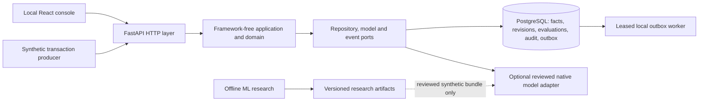

# FraudLens

FraudLens is a research-oriented, explainable behavioral fraud-detection system. It explores how a customer profile can adapt to confirmed ordinary behavior without learning an exceptional purchase or an unverified transfer as normal.

**Status:** The original local engineering objectives through Phase 16 and the Phase 17 research preparation are complete. Phase 18 documentation and release polish is in progress. FraudLens is a **local, experimental portfolio project**, not a deployed banking fraud product. Production behavioral validation and the Phase 15 remote human-authentication security gate remain open. [Current evidence and limitations](PROJECT_STATUS.md) are the source of truth.

## What it demonstrates

- Immutable synthetic transaction intake with scoped credentials, durable idempotency, audit and PostgreSQL outbox records.
- Versioned per-customer, per-currency profiles using median, MAD, p95 and short/long windows. Cold or insufficient history is explicit.
- Ordered behavior-v1 features, deterministic rules, supplemental sequence evidence, and a separately authorized profile-learning gate.
- Opt-in, uncalibrated experimental evaluation and case review. Suggested actions are not banking actions; a review verdict does not automatically admit a transaction to a profile.
- A local React analyst console with scoped human sessions. Local analysts can use password plus WebAuthn; production human authentication fails closed.
- A read-only, admin-only [Scenario lab](data/synthetic/README.md) with five deterministic synthetic stories. All five controlled checks pass, while the first two transfers in story E remain LOW/ALLOW under both risk-v1 and the experimental risk-v2 sequence review floor.

The native XGBoost behavior-v1 adapter uses reviewed **synthetic-only** artifacts for experimental replay/evaluation. The Scenario lab itself does **not** run ML. A separate five-field [IEEE-CIS retrospective benchmark](ml/experiments/ieee-cis-retrospective-v1/README.md) compared Logistic Regression, Random Forest and XGBoost; its final-test average precision was 0.133940. That benchmark cannot validate FraudLens customer profiles or graph relationships and is not a serving model. The [prospective behavioral validation protocol](docs/research/phase17-prospective-behavioral-validation-v1.md) remains blocked on a suitable, independently permitted source.

## Architecture



`backend/app` contains domain and application logic without FastAPI, SQLAlchemy or ML imports. `backend/api` handles HTTP and authorization; `backend/adapters` implements persistence and model/event ports. `ml/src` is offline research code and is excluded from the serving wheel. The [architecture guide](docs/architecture/README.md), [detector layers](docs/architecture/detector-layers.md) and [ADRs](docs/adr/) describe the boundaries in detail.

## Run locally

Use Python 3.13, [uv](https://docs.astral.sh/uv/), Node.js and PostgreSQL 17. The existing disposable test cluster and account-provisioning steps are in [development.md](development.md). Never point migrations, tests or demo commands at production data.

```sh
uv sync --locked --group ml
export TEST_DATABASE_URL='postgresql+psycopg:///fraudlens_test?host=/private/tmp&port=55439'
export FRAUDLENS_DATABASE_URL="$TEST_DATABASE_URL"
.venv/bin/alembic upgrade head
```

For a **local-only** analyst console, provision a synthetic human account with the operator CLI documented in [development.md](development.md#phase-15-local-human-sessions-completed-local-checkpoint). Then start the backend in one terminal:

```sh
export FRAUDLENS_HUMAN_AUTH_ENABLED=true
export FRAUDLENS_HUMAN_ORIGIN=http://127.0.0.1:5173
export FRAUDLENS_HUMAN_LOCAL_INSECURE=true
export FRAUDLENS_EXPERIMENTAL_ENABLED=true
.venv/bin/uvicorn backend.main:app --host 127.0.0.1 --port 8000
```

Start the frontend in another terminal:

```sh
cd frontend
npm ci
npm run dev -- --port 5173
```

Open `http://127.0.0.1:5173`. An admin sees **Scenario lab**. `GET /health/live` checks API process liveness; it does not prove database or model readiness. Business endpoints fail closed without configuration and authorization. The local HTTP cookie setting above is for loopback development only.

For a database-free controlled simulation, follow [data/synthetic/README.md](data/synthetic/README.md). The separate 62-transaction PostgreSQL [analyst walkthrough](docs/demo/README.md) remains optional and incomplete; its authored story text is not a verified analyst verdict.

## Verification

```sh
.venv/bin/alembic check
.venv/bin/pytest --cov=backend --cov=ml.src
.venv/bin/ruff check .
.venv/bin/ruff format --check .
.venv/bin/mypy
cd frontend && npm run lint && npm test && npm run build
```

The tests require a disposable PostgreSQL `*_test` database; a skipped database test is not PostgreSQL verification. The [CI workflow](.github/workflows/ci.yml) also builds backend/frontend images, but its presence is not evidence of a successful remote run. The current Compose stack is development-only and uses owner credentials. See [deployment gates](docs/security/deployment-gates.md) before any remote exposure.

## Screenshots

The [screenshot notes](docs/demo/screenshots/README.md) identify three real local synthetic-console captures and their limits, including a current authenticated admin Scenario lab view. A worklist image showing **NOT EVALUATED** means those facts had no retained evaluation; it is not a model result. The Scenario lab displays authored expectations separately from actual experimental policy outcomes.

## Limits and next work

Rules, model scores, decision thresholds and the risk-v2 sequence review floor are uncalibrated and production-ineligible. Missing evidence must remain visible. The IEEE-CIS and ULB external datasets do not contain the verified behavioral identities, clocks and admission lineage needed for production profile validation. Phase 15 remote security, real four-role/TLS deployment, independent security assessment and the optional human analyst walkthrough remain separate open gates. Future graph or additional model layers need authoritative point-in-time relationships and independent validation before they can affect decisions.

See [PROJECT_STATUS.md](PROJECT_STATUS.md), [NEXT_SESSION_PROMPT.md](NEXT_SESSION_PROMPT.md) and [SESSION_LOG.md](SESSION_LOG.md) for the current checkpoint.
