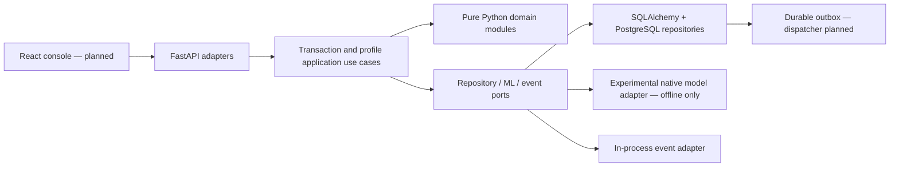

# FraudLens

**Explainable Adaptive Behavioral Fraud Detection System**

FraudLens is a research-oriented modular monolith investigating how banking fraud
detection can learn legitimate behavior changes without letting exceptional or
fraudulent transactions corrupt a customer's normal baseline.

**Status: Phase 10 experimental explainability checkpoint; not a deployable fraud product.**
Submission/retrieval, scoped service credentials, durable request replay and atomic
audit/outbox storage are implemented on PostgreSQL. There is no durable risk evaluation or
HTTP model inference, human login or analyst console yet.
Profile reads now expose robust short/long statistics, cold-start states and immutable
revision selection. Profile admission remains closed pending trusted-history workflows.
The pure feature engine provides 29 ordered features with explicit missing-history indicators,
scoped PostgreSQL capture and offline artifact replay. See [development.md](development.md)
for capture/replay commands and [ADR-010](docs/adr/ADR-010-feature-context-and-availability.md)
for temporal and provenance limits.
Five versioned rules now produce stable reasons and explicit unavailable-input outcomes
from captured features; local rule replay is documented in the development runbook.
Experimental offline model replay now verifies native artifacts and exact feature contracts.
It remains synthetic-only and does not load a model into HTTP routes. See
[ADR-014](docs/adr/ADR-014-experimental-native-inference.md).
Rules-only, ML-only and hybrid offline risk replay now retain complete policy/evidence.
Missing required rule evidence produces no hybrid/rules-only score or action; all suggested
actions remain experimental and unexecuted. See [ADR-015](docs/adr/ADR-015-experimental-risk-and-decision.md).
Native TreeSHAP now explains the model margin with checked additivity and readable,
missing-aware contributions. Rule reasons stay separate; no causal claim is made. Add
`--explain` to offline risk replay; see [ADR-016](docs/adr/ADR-016-native-model-explanations.md).
See [PROJECT_STATUS.md](PROJECT_STATUS.md) for verified progress.

## Problem and behavioral fraud detection

A customer normally spending ₸30,000 may legitimately buy an ₸8,000,000 vehicle.
Treating every observed transaction as normal can contaminate an adaptive baseline
and make the next ₸500,000 fraudulent transfer look less unusual. Global amount
thresholds also miss differences between customers.

## Key idea: safe adaptive profiling

Keep risk evaluation separate from analyst truth and from permission to learn.
The initial pure domain implementation uses per-customer, per-currency rolling
median, MAD, nearest-rank p95, and short/long windows. A profile-update gate rejects
confirmed fraud, quarantines unverified activity, and keeps extreme legitimate
events outside the normal baseline. Ordinary confirmed transactions can enter it.

The current 10× median gate and five-observation minimum are **uncalibrated
research assumptions**. Low-weight updates, bootstrap enrollment, suspicious
sequence detection, provenance enforcement and retractions remain future work.
Compromised analyst confirmations are not solved by this initial gate.

## Architecture



Domain code under `backend/app` imports no web framework, ORM or ML library.
Financial amounts use `Decimal`; timestamps must be timezone-aware and normalize
to UTC. Customer-local hours use IANA timezones. See
[architecture](docs/architecture/README.md) and [ADRs](docs/adr/).

## Screenshots

No frontend exists yet. Actual analyst-console screenshots will be added in Phase
18; no mock screenshot is presented as functioning software.

## Demo scenarios

Domain regression tests cover normal confirmed activity, a quarantined ₸8M
purchase, preserved baseline for a subsequent ₸500k transfer, gradual confirmed
spending changes, and an unverified escalating sequence. Full seeded banking
scenarios and a live analyst demonstration are scheduled for Phase 16.

## Tech stack

Current: Python 3.13, uv, FastAPI/Pydantic, SQLAlchemy 2, Alembic, PostgreSQL
Compose configuration, pytest, Ruff, mypy and pip-audit.

Offline ML group: NumPy, scikit-learn and XGBoost.
Planned: React/TypeScript/Vite and SHAP.

## ML methodology and metrics

Three-seed **synthetic-only** comparisons now train Logistic Regression, Random Forest
and XGBoost with chronological train/validation/test splits and held-out customers.
[Measured results](ml/experiments/phase7-synthetic-v1/README.md) are engineering evidence,
not real-world fraud performance. A separate [ULB retrospective benchmark](ml/experiments/ulb-retrospective-v1/README.md)
now compares anonymized external features under its own contract. Neither result selects
a production behavioral model. Fit transforms and class-balancing methods on training data only.
Evaluate precision, recall, F1, ROC-AUC, PR-AUC and false-positive rate. Choose
thresholds and models on validation data; report the untouched test set once.
Feature generation must replay only history available before each transaction.
See [research protocol](docs/research/protocol.md).

## API

- `GET /health/live`: process liveness, version and implementation stage.
- `GET /docs`: development OpenAPI explorer.
- `POST /api/v1/customers`: admin-only synthetic customer enrollment; no profile admission.
- `POST /api/v1/transactions`: scoped service/admin intake with required Idempotency-Key.
- `GET /api/v1/transactions/{transaction_id}`: scoped service/analyst or admin retrieval.
- `GET /api/v1/customers/{customer_id}/profiles/{currency}`: scoped behavior summary;
  explicit historical cutoffs require a pinned profile version.

All business routes require an expiring bearer service credential. Intake returns
201 and RECEIVED status; matching retries return the exact stored response, changed
bodies or duplicate transaction IDs return 409. Amounts are decimal strings and
timestamps require a timezone. No risk prediction is fabricated. See the
[API setup and examples](development.md#authenticated-synthetic-api).
Liveness does not establish database/model readiness.

## How to run

Install [uv](https://docs.astral.sh/uv/getting-started/installation/), then:

```sh
uv sync --locked
uv run uvicorn backend.main:app --reload --host 127.0.0.1
```

Open http://127.0.0.1:8000/docs or http://127.0.0.1:8000/health/live.
Liveness runs without a database; business endpoints fail closed without credentials
and configured PostgreSQL. PostgreSQL and container foundation:

```sh
cp .env.example .env
# Edit .env: choose a local alphanumeric POSTGRES_PASSWORD and match DATABASE_URL.
docker compose up --build -d
docker compose exec backend alembic upgrade head
```

Migrations now create 15 business tables and database history protections, including
an immutable profile revision journal.
The initial foundation marker is preserved in migration history. Compose currently contains backend and PostgreSQL only; a
frontend service will be added when the console exists. Use a dedicated local
database; never point migration/test commands at a real banking database.

## Testing

```sh
uv run ruff check .
uv run ruff format --check .
uv run --group ml mypy
uv run --group ml pytest --cov=backend --cov-report=term-missing
uv export --locked --format requirements-txt --no-emit-project --no-hashes > /tmp/fraudlens-requirements.txt
uv run pip-audit --disable-pip --no-deps -r /tmp/fraudlens-requirements.txt
uv build
```

PostgreSQL tests skip explicitly unless `TEST_DATABASE_URL` points to a disposable
PostgreSQL database named `*_test`. Tests use a randomly named schema and remove
only that schema after execution. See [local PostgreSQL setup](development.md). CI supplies it and runs Alembic, tests,
dependency audit, package build and container build. A CI configuration is not a
claim that a remote workflow has run. Future ML/E2E test folders are documented
placeholders, not fake passing tests.

## Security

Synthetic UUIDs only; no real cardholder or identity data. No credentials in code;
database configuration uses environment variables and redacts secrets in settings.
Docker runs the backend without root and binds host ports to localhost. Production
mode hides API documentation. PostgreSQL triggers reject edits/deletes to historical
records, and repository writes participate in one explicit database transaction.
Business routes now use expiring hashed random service credentials, role/customer
scope checks, bounded request bodies and sanitized errors. Human authentication,
restricted runtime database grants, distributed rate limits and secure deployment
review remain future work. Keep this synthetic demo on localhost; remote use needs TLS.
A privileged database administrator can disable triggers; these guards are not
cryptographic tamper evidence.

## Limitations and research direction

This checkpoint verifies authenticated intake and domain invariants; it does not
establish fraud-detection accuracy or deployment security. Profile observations are
persisted; robust statistics are computed in
memory from the active window. Phase 4 summaries qualify typical hours using explicit,
uncalibrated count/share thresholds and expose the underlying counts. No categories,
device history, recipient ages, feature
extraction or model artifact exists. Outbox storage and delivery metadata exist,
but background dispatch and consumer deduplication remain unimplemented.
Authentication and application workflows must enforce trusted feedback provenance. See the research protocol for baseline comparisons and
threats to validity.

## Roadmap

1. Foundation and pure domain — implemented.
2. PostgreSQL tables, repositories, atomic unit of work and migration tests — implemented.
3. Authenticated transaction API with durable, scoped idempotency — implemented.
4. Versioned profile reads and behavior summaries — implemented; trusted admission remains deferred.
5. Production features and deterministic rules.
6. Offline model comparison, inference, hybrid risk and SHAP.
7. Cases, feedback, profile update use cases, outbox delivery.
8. Analyst console, security review, deterministic demos and research experiments.

## Continuation

Read [PROJECT_STATUS.md](PROJECT_STATUS.md), then
[NEXT_SESSION_PROMPT.md](NEXT_SESSION_PROMPT.md). Session facts are appended to
[SESSION_LOG.md](SESSION_LOG.md). The original specification is preserved in
[docs/PROJECT_SPECIFICATION.md](docs/PROJECT_SPECIFICATION.md).
