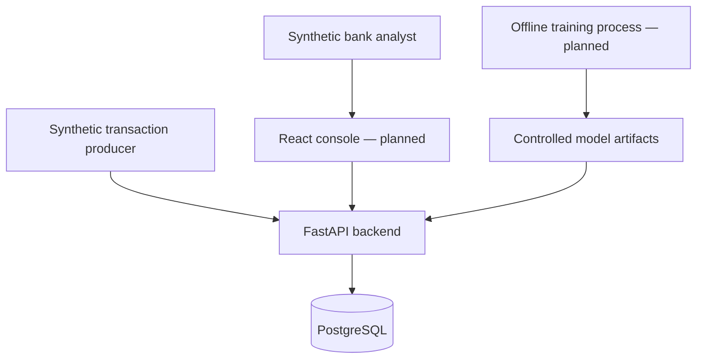

# Architecture and module boundaries

## Context and containers (C4 style)

HTTP exposes liveness, authenticated synthetic customer enrollment and scoped
transaction submission/retrieval and profile reads. PostgreSQL repositories and an atomic unit of
work back the intake use cases. React, ML and evaluation integrations remain planned.

## Responsibility map

| Module | Ownership | Current state |
|---|---|---|
| transaction | Immutable transaction, intake/retrieval, canonical idempotency | Domain + authenticated API implemented |
| profile | Customer, observations, robust windows, revision-pinned reads, snapshots, update gate | Domain + scoped read API; trusted admission deferred |
| features | 29 ordered versioned features, immutable contexts and scoped capture | Pure extractor + artifact replay |
| fraud | Prediction/model metadata and model strategy port | Contract only |
| rules | Versioned specifications, evidence, reason codes and missing-input outcomes | Pure engine + local replay |
| risk | Assessment/reason values and aggregation strategies | Domain implemented |
| decision | Configurable risk-to-action thresholds | Domain implemented |
| explainability | Human reasons and technical SHAP contributions | Planned |
| cases | Strict lifecycle and immutable transition history | Domain implemented |
| feedback | Analyst verdict and prediction provenance | Domain record implemented |
| audit | Append-only action record | Domain + database append-only guards |
| shared | Validation, ports, event envelope and outbox record | Contracts implemented |

## Transaction boundaries

The implemented `PostgresUnitOfWork` owns one database transaction. Repositories
flush without committing; explicit `commit()` is required. Otherwise context exit
rolls back. Database constraint failures also roll back and become domain
`PersistenceConflict` errors. Let write failures exit the context; do not catch a
repository failure and then commit partially completed application work.

The implemented intake use case checks the authenticated principal's role/customer
scope, locks `(principal_id, idempotency_key)`, and commits transaction, audit,
TransactionReceived outbox event and response record together. Matching retries
short-circuit before business writes. Customer enrollment is admin-only and creates
no profile history. Future evaluation will additionally version/capture the relevant
profile, assessment and optional case. Never send side effects before commit.

Idempotency compares a versioned canonical request fingerprint. Same key and same body
returns the original response; same key and different body returns 409. A unique
constraint resolves races. A duplicate transaction ID with a different key must
also be handled explicitly. No in-memory dictionary can guarantee durable
idempotency. Exact successful response JSON/status are stored in PostgreSQL and
replayed even across API process restarts. See [ADR-008](../adr/ADR-008-transaction-api-and-service-credentials.md).

Outbox workers deliver after commit, retry failures and record attempt counts.
Multiple handlers can receive duplicates after partial delivery; consumers must
deduplicate event IDs transactionally. The current in-memory publisher propagates
exceptions; it is only an adapter, not an outbox worker.

## Profile semantics

- One currency per profile; never mix KZT/USD nominal amounts.
- Window semantics: `(as_of - window, as_of]`; observations may not be in the future.
- 180-day long window and 30-day short window; median/MAD use Decimal; p95 uses
  nearest rank. Windows and minimum trusted history are explicit policies.
- `ProfileObservation` means already admitted by a trusted process. Enrollment and
  repository hydration must enforce that provenance in the application layer.
- The gate rolls the baseline forward to transaction time, preventing stale
  history from silently authorizing updates. Historical data requires replay.
- `apply` is a pure operation returning the decision and a new immutable profile.
  Quarantine/rejection leaves the supplied profile unchanged. No persistence or
  automatic trust is implied.
- Profile version increments on admission. Repositories lock the profile head and
  compare the expected version before writing. Unique observation IDs prevent
  duplicate admission. Expired observations remain in append-only storage while
  retrieval returns the active window. Admissions are version-filtered so a read
  of an older head cannot accidentally include a concurrent writer's observations.
- Legacy domain typical_hours means observed local hours. Phase 4 read summaries
  expose counts and explicit frequency-qualified descriptive hours, per-window
  observation frequency and known recipients. Phase 5 adds separate bounded raw device/recipient activity and velocity features;
  trusted warm-up remains unresolved.

## Versioned profile reads

See [ADR-009](../adr/ADR-009-profile-reads-and-history.md). The profile application
service reads through the repository port, enforces customer scope and distinguishes
uninitialized, empty and insufficient history. Historical cutoffs require a pinned
revision; future event facts and later-version admissions are excluded. No read mutates
the profile, captures an assessment snapshot, or treats raw intake as trusted history.

PostgreSQL archives metadata on every head change. A deferred constraint binds new
observations to a revision created by that database transaction, sealing committed
revision sets. Concurrent reads pin a metadata revision before loading observations.
The upgrade captures existing heads only; it cannot reconstruct lost metadata versions.
For research, callers must supply versions captured before the original decision;
event time alone cannot reconstruct historical knowledge or feedback availability.

## Policy assumptions

Initial decision boundaries are 0.35 / 0.65 / 0.85 with an explicit experimental
policy version. They are illustrative defaults, not calibrated operating points.
Hybrid aggregation requires the caller to select an ML weight; no hidden weight
is chosen. An aggregate score is not necessarily a calibrated probability.

Case transitions require OPEN -> UNDER_REVIEW -> LEGITIMATE or CONFIRMED_FRAUD
-> CLOSED. A terminal verdict is not silently replaced. Reopening/correction
requires a separately designed audited workflow. `NEEDS_INVESTIGATION` is an
analyst verdict that will keep a case under review, not a new terminal case state.

## Implementation references

The dependency workflow follows [uv locking and syncing](https://docs.astral.sh/uv/concepts/projects/sync/)
and [uv Docker integration](https://docs.astral.sh/uv/guides/integration/docker/).
Persistence uses [SQLAlchemy typed declarative tables](https://docs.sqlalchemy.org/en/20/orm/declarative_tables.html).

## Implemented persistence details

See [ADR-007](../adr/ADR-007-persistence-consistency.md). Tables cover customers,
transactions, profile heads/observations/snapshots, model/rule versions, risk
assessments, fraud cases/transitions, analyst decisions, audit, outbox and scoped
idempotency records. PostgreSQL uses NUMERIC(18,2), TIMESTAMPTZ and UUID columns.

Snapshots preserve exact Decimal values as strings in versioned JSON. Deferred
foreign keys bind each snapshot to its assessment; composite foreign keys enforce
transaction/customer/currency and model/feature consistency. Phase 5 implements strict feature history cutoffs and local context replay; atomic
assessment/context persistence remains future evaluation work.

`idempotency.acquire(principal_id, key, request_sha256)` must run before business
writes. A transaction-scoped PostgreSQL advisory lock serializes identical scoped
keys. A matching completed request returns its stored response; a changed digest
raises `IdempotencyConflict`. Store the response and business writes in the same
unit of work. Hash collisions only serialize unrelated requests; durable identity
is the full composite primary key. Phase 3 implements HTTP digest canonicalization,
201 replay, expiring service credentials, customer scopes and a 16 KiB body limit.

Case history has both domain checks and a database insertion trigger that locks
the case and enforces sequence, source state and timestamp. Historical tables reject
UPDATE, DELETE and TRUNCATE. Outbox payloads are immutable, attempts may increase,
and a published event cannot be reverted. Model status is mutable but its training
provenance is not. Transactions are currently immutable, including their stored
status; derive evaluation state from assessments until an audited lifecycle is
explicitly implemented. Runtime database roles must not own schema/trigger objects.

## Shared feature preparation

See [ADR-010](../adr/ADR-010-feature-context-and-availability.md). Framework-free contexts
and one pure extractor serve both capture and offline batches. Infrastructure supplies
a scoped, cutoff-safe PostgreSQL history query and strict local artifact serialization.
Saved contexts pin input facts; event-time queries do not reconstruct past availability.
No feature operation changes profiles or evaluates fraud risk.

## Deterministic rules

[ADR-011](../adr/ADR-011-deterministic-rules.md) defines rules-v1 on behavior-v1.
The shared threshold specification implements the existing port; complete reports
retain policy fingerprints and three-state outcomes. No ORM/HTTP dependencies, risk
score or profile mutation are introduced. Assessment integration remains future work.
