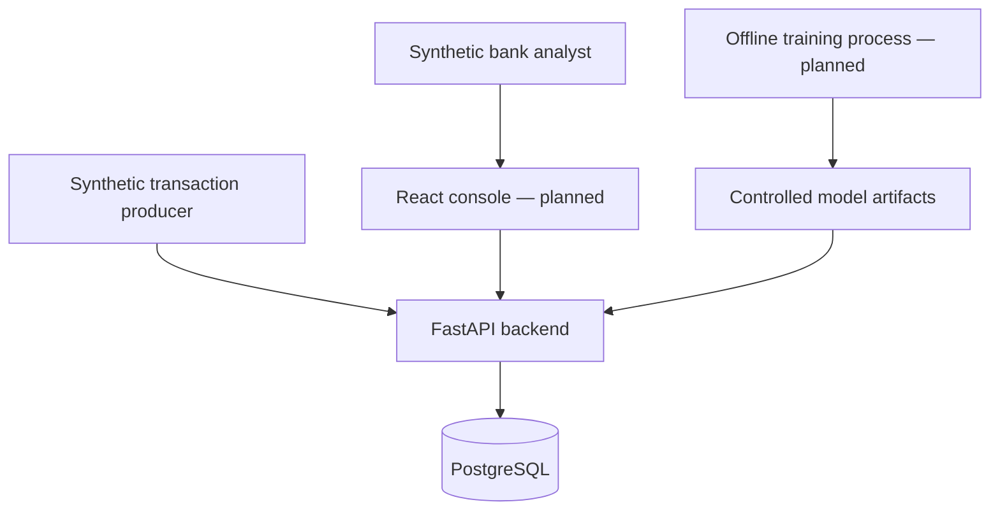

# Architecture and module boundaries

## Context and containers (C4 style)

Only liveness is currently exposed over HTTP. PostgreSQL wiring and migration
foundation exist, but no business tables do. Diagrams describe the intended system,
not completed integrations.

## Responsibility map

| Module | Ownership | Current state |
|---|---|---|
| transaction | Immutable synthetic transaction, amount/time validation | Domain implemented |
| profile | Customer, observations, robust windows, snapshots, update gate | Initial domain implemented |
| features | Ordered versioned numerical input | Contract only |
| fraud | Prediction/model metadata and model strategy port | Contract only |
| rules | Specification contract and rule version | Contract only |
| risk | Assessment/reason values and aggregation strategies | Domain implemented |
| decision | Configurable risk-to-action thresholds | Domain implemented |
| explainability | Human reasons and technical SHAP contributions | Planned |
| cases | Strict lifecycle and immutable transition history | Domain implemented |
| feedback | Analyst verdict and prediction provenance | Domain record implemented |
| audit | Append-only action record | Frozen domain record only |
| shared | Validation, ports, event envelope and outbox record | Contracts implemented |

## Transaction boundaries (planned Phase 2 onward)

A unit of work owns a database transaction. The evaluation use case will lock or
version the relevant profile, claim `(principal_id, idempotency_key)`, persist the
transaction, immutable profile snapshot, assessment, optional case, audit and
outbox records, and then commit once. Never send side effects before commit.

Idempotency must compare a canonical request fingerprint. Same key and same body
returns the original response; same key and different body returns 409. A unique
constraint resolves races. A duplicate transaction ID with a different key must
also be handled explicitly. No in-memory dictionary can guarantee durable
idempotency. No idempotency API is implemented at this checkpoint.

Outbox workers deliver after commit, retry failures and record attempt counts.
Multiple handlers can receive duplicates after partial delivery; consumers must
deduplicate event IDs transactionally. The current in-memory publisher propagates
exceptions; it is only an adapter, not an outbox worker.

## Profile semantics

- One currency per profile; never mix KZT/USD nominal amounts.
- Window semantics: `(as_of - window, as_of]`; observations may not be in the future.
- 180-day long window and 30-day short window; median/MAD use Decimal; p95 uses
  nearest rank. Windows and minimum trusted history are explicit policies.
- `ProfileObservation` means already admitted by a trusted process. Enrollment and
  repository hydration must enforce that provenance in the application layer.
- The gate rolls the baseline forward to transaction time, preventing stale
  history from silently authorizing updates. Historical data requires replay.
- `apply` is a pure operation returning the decision and a new immutable profile.
  Quarantine/rejection leaves the supplied profile unchanged. No persistence or
  automatic trust is implied.
- Profile version increments on admission. Future repositories must enforce
  optimistic concurrency with expected versions and unique observation IDs.
- Current typical hours mean observed local hours; frequency estimates, categories,
  devices, recipient age, event-time velocity and warm-up procedures remain Phase 4.

## Policy assumptions

Initial decision boundaries are 0.35 / 0.65 / 0.85 with an explicit experimental
policy version. They are illustrative defaults, not calibrated operating points.
Hybrid aggregation requires the caller to select an ML weight; no hidden weight
is chosen. An aggregate score is not necessarily a calibrated probability.

Case transitions require OPEN -> UNDER_REVIEW -> LEGITIMATE or CONFIRMED_FRAUD
-> CLOSED. A terminal verdict is not silently replaced. Reopening/correction
requires a separately designed audited workflow. `NEEDS_INVESTIGATION` is an
analyst verdict that will keep a case under review, not a new terminal case state.

## Implementation references

The dependency workflow follows [uv locking and syncing](https://docs.astral.sh/uv/concepts/projects/sync/)
and [uv Docker integration](https://docs.astral.sh/uv/guides/integration/docker/).
Persistence will use [SQLAlchemy typed declarative tables](https://docs.sqlalchemy.org/en/20/orm/declarative_tables.html).
