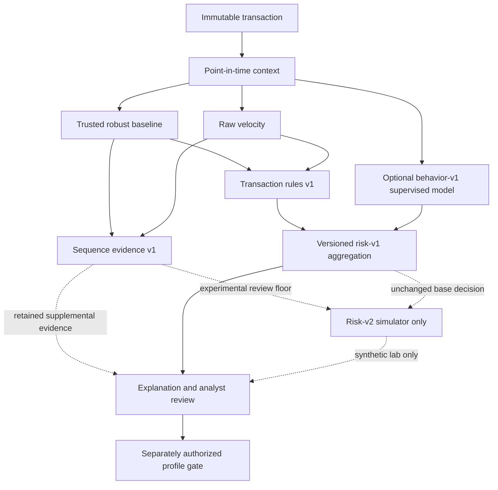

# FraudLens detector layers

FraudLens evaluates retained evidence in layers. A layer may be unavailable; absence
is data, not a zero-risk signal.

Current risk-v1 combines the frozen five-rule result with the optional reviewed
synthetic model. Sequence-v1 is retained beside that result and is not scored. This
preserves historical score meaning. A separate, uncalibrated risk-v2 review floor
uses complete sequence matches in the offline controlled simulator and its
read-only page. It does not change durable evaluations or banking actions.

## Current evidence

- Trusted profiles: median, MAD, p95, short/long windows, known recipients and hours.
- Raw activity: same customer/currency, strict event-time cutoff, up to 180 days.
- Rules: amount anomaly, new recipient, five-minute velocity, unusual time and device change.
- Sequence: low-value cumulative transfer pattern, escalation, repeated new recipient and
  cumulative 24-hour exposure.
- Optional supervised model: reviewed synthetic-only native XGBoost on exact behavior-v1.
- Review/profile learning: immutable evidence and independent admin authorization.

## Inputs required before adding more layers

| Proposed layer | Required authoritative point-in-time input |
| --- | --- |
| Device intelligence | first/last seen, account links, device integrity and confirmed outcomes |
| Network/location | versioned IP/geolocation, VPN/proxy confidence and session timestamps |
| Account-takeover sequence | login, password, beneficiary, balance and challenge events |
| Graph risk | cross-customer account/device/IP/recipient edges with availability times |
| Unsupervised anomaly | leakage-safe training population, preprocessing artifact and threshold protocol |

No layer should be added merely by converting IDs to numeric values. Every adapter needs
an explicit input contract, availability semantics, replay artifact, validation protocol
and failure behavior before its output can enter risk aggregation.
