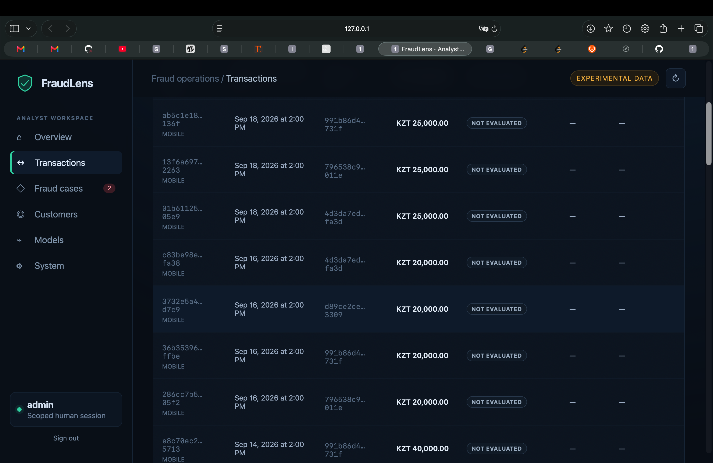
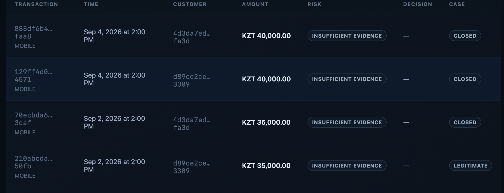

# Local synthetic-console screenshots

This unaltered user-supplied local screenshot shows seeded synthetic transactions marked **NOT EVALUATED**. No risk or ML result has been stored for those rows. Source image SHA-256: `1fccf9de3fb0d43da8a5f5ce9183982d09e695bb75ba8daf8db092ae8e72c7b8`.

This is an unaltered screenshot supplied during the local Phase 16 analyst walkthrough. The UUIDs and transactions are synthetic. It shows retained **INSUFFICIENT EVIDENCE** evaluations and case states in the worklist; the visible `LEGITIMATE` entry is a recorded local role-play review, not independently verified banking truth. It does not show the Scenario lab or ML inference. Source image SHA-256: `546c536b6b2acada0aaf6584092aa491497597d8711671999a06f7a931d70f4e`.

A current Scenario lab screenshot still needs capture from a running, authenticated local admin console. Its A–E expectations are authored oracle checks and must be labeled separately from the experimental outcomes. Do not use a static mock screen or a synthetic story label as proof of field detection performance.
