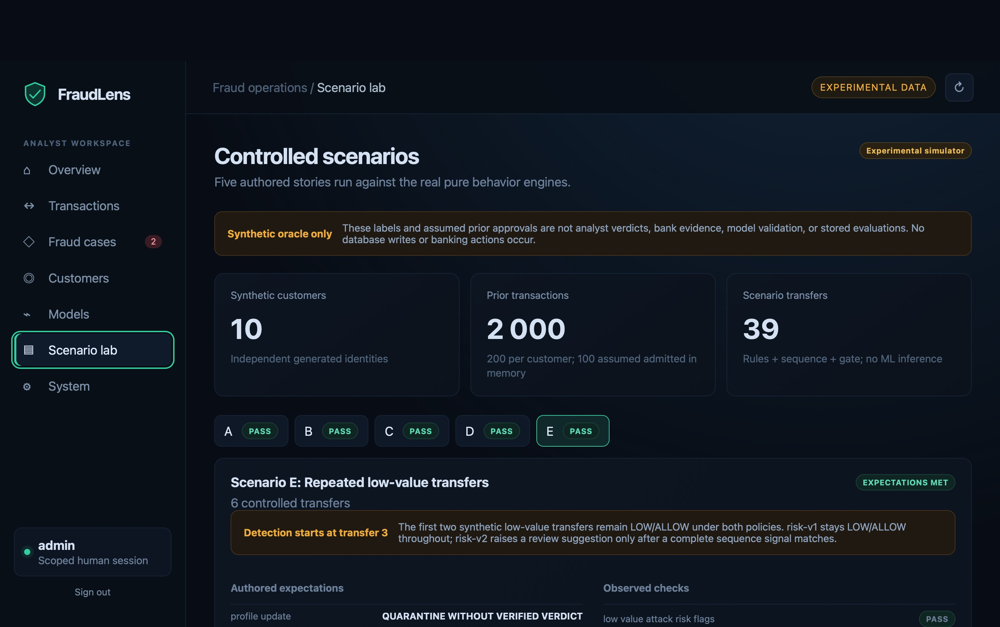

# Local synthetic-console screenshots

This unaltered user-supplied local screenshot shows seeded synthetic transactions marked **NOT EVALUATED**. No risk or ML result has been stored for those rows. Source image SHA-256: `1fccf9de3fb0d43da8a5f5ce9183982d09e695bb75ba8daf8db092ae8e72c7b8`.

This is an unaltered screenshot supplied during the local Phase 16 analyst walkthrough. The UUIDs and transactions are synthetic. It shows retained **INSUFFICIENT EVIDENCE** evaluations and case states in the worklist; the visible `LEGITIMATE` entry is a recorded local role-play review, not independently verified banking truth. It does not show the Scenario lab or ML inference. Source image SHA-256: `546c536b6b2acada0aaf6584092aa491497597d8711671999a06f7a931d70f4e`.

Captured on 2026-09-29 from the running local console at `127.0.0.1:5173`, signed in as a local admin. This is a real, unaltered browser capture, not a mock screen. Image SHA-256: `a675c41cca2a9dcf37126c968155c91aeec1c76babe1d52746215bc53ff413cc`. The lab reports 10 synthetic customers, 2,000 prior transactions and 39 A–E candidates. Its five **PASS** indicators compare observed deterministic outcomes with **authored synthetic expectations**, not independent analyst verdicts or field detection rates. In the visible Scenario E, risk-v1 permits all six transfers; experimental risk-v2 suggests review only after a complete sequence match, starting at transfer three. The first two transfers remain LOW/ALLOW. The Scenario lab runs in memory and does not perform ML inference or write evaluations or profile admissions to PostgreSQL.
